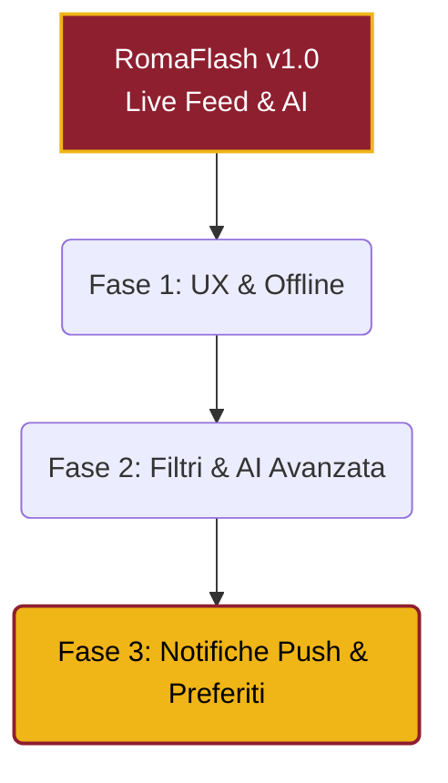

# Roadmap di Sviluppo: RomaFlash PWA 🚀

Ora che abbiamo una PWA funzionante, autonoma e veloce, l'obiettivo è trasformarla da un "sito web veloce" a una vera e propria **App Nativa Premium** agli occhi degli utenti.

Ecco una roadmap divisa in 3 fasi per elevare RomaFlash al livello successivo.

---

### Fase 1: La vera esperienza App (Veloce, Affidabile, Offline)

> [!TIP]
> Queste implementazioni aumenteranno drasticamente il tempo che gli utenti trascorrono sull'app.

*   **1. Funzionamento Offline (Service Workers):** Attualmente se l'utente apre l'app senza connessione (es. in metropolitana), vedrà un errore. Implementando un _Service Worker_ con Workbox, possiamo far sì che l'app carichi all'istante l'ultimo feed scaricato in precedenza, permettendogli di leggere le notizie offline.
*   **2. Pull-to-Refresh Nativo:** Implementare un gesto di scorrimento verso il basso (come su Instagram o X) per ricaricare forzatamente il feed senza dover usare il tasto "aggiorna" del browser.
*   **3. Banner Guida iOS:** Come abbiamo visto, Apple non aiuta. Possiamo programmare un piccolo e non invasivo banner animato che compare in basso solo agli utenti iPhone, indicando fisicamente dove cliccare per aggiungere l'app alla Home.
*   **4. Tasto Condivisione Nativa (Web Share API):** Un bottone sugli articoli che apre direttamente il menu di condivisione di sistema del telefono (per mandare l'articolo su WhatsApp, Telegram o Storie).

---

### Fase 2: Evoluzione dell'Intelligenza Artificiale

> [!IMPORTANT]
> Sfruttiamo Gemini per categorizzare i contenuti, non solo per riassumerli.

*   **1. Tag e Categorie AI:** Possiamo dire a Gemini di aggiungere al file JSON anche una categoria (es. `Calciomercato`, `Infortunio`, `Dichiarazioni`, `Partita`). In questo modo possiamo aggiungere dei "pill" (pulsanti) in cima all'app per filtrare istantaneamente le notizie.
*   **2. Analisi del "Sentiment":** Gemini può dirci se la notizia è "Positiva", "Negativa" o "Neutra". Potremmo mostrare una micro-icona (es. fuoco 🔥, fulmine ⚡, o ghiaccio ❄️) accanto al titolo.
*   **3. Infinite Scroll:** Ora carichiamo solo 20 notizie. Possiamo implementare lo scorrimento infinito, caricando blocchi di 20 vecchie notizie mano a mano che l'utente arriva in fondo alla pagina.

---

### Fase 3: Fidelizzazione e Utenti Attivi

> [!NOTE]
> Quando il traffico diventerà consistente, questi strumenti manterranno gli utenti incollati a RomaFlash.

*   **1. Web Push Notifications:** La killer-feature. Implementare le notifiche Push (ora supportate nativamente anche da iOS/Safari). L'utente accetta di ricevere notifiche, e ogni volta che il nostro motore scova una "Bomba di mercato" (Gemini può classificarla in automatico per importanza), invia una notifica direttamente sul display del telefono!
*   **2. Articoli Salvati (Bookmarks):** Permettere agli utenti (magari creando un semplice login anonimo o via Google) di salvarsi gli articoli da rileggere, usando la tab "Preferiti" che abbiamo in basso.
*   **3. Ricerca Veloce:** Una barra di ricerca in alto che interroga istantaneamente il database Supabase per trovare vecchie dichiarazioni o articoli di calciomercato.

