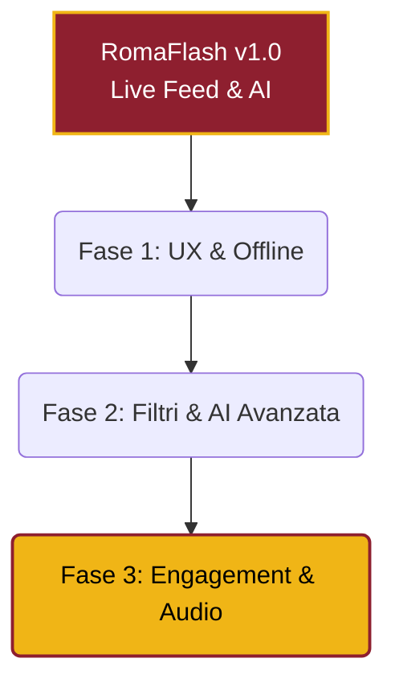

# Roadmap di Sviluppo: RomaFlash PWA 🚀

Ora che abbiamo una PWA funzionante, autonoma e veloce, l'obiettivo è trasformarla da un "sito web veloce" a una vera e propria **App Nativa Premium** agli occhi degli utenti.

Ecco una roadmap divisa in 3 fasi per elevare RomaFlash al livello successivo.

---

### Fase 1: La vera esperienza App (Veloce, Affidabile, Offline)

> [!TIP]
> Queste implementazioni aumenteranno drasticamente il tempo che gli utenti trascorrono sull'app.

*   **1. Funzionamento Offline (Service Workers):** Attualmente se l'utente apre l'app senza connessione (es. in metropolitana), vedrà un errore. Implementando un _Service Worker_ con Workbox, possiamo far sì che l'app carichi all'istante l'ultimo feed scaricato in precedenza, permettendogli di leggere le notizie offline.
*   ~~**2. Pull-to-Refresh Nativo:** Implementare un gesto di scorrimento verso il basso (come su Instagram o X) per ricaricare forzatamente il feed senza dover usare il tasto "aggiorna" del browser.~~ ✅ **(Completato)**
*   **3. Banner Guida iOS:** Come abbiamo visto, Apple non aiuta. Possiamo programmare un piccolo e non invasivo banner animato che compare in basso solo agli utenti iPhone, indicando fisicamente dove cliccare per aggiungere l'app alla Home.
*   ~~**4. Tasto Condivisione Nativa (Web Share API):** Un bottone sugli articoli che apre direttamente il menu di condivisione di sistema del telefono (per mandare l'articolo su WhatsApp, Telegram o Storie).~~ ✅ **(Completato)**

---

### Fase 2: Evoluzione dell'Intelligenza Artificiale

> [!IMPORTANT]
> Sfruttiamo Gemini per categorizzare i contenuti, non solo per riassumerli.

*   ~~**1. Tag e Categorie AI:** Possiamo dire a Gemini di aggiungere al file JSON anche una categoria (es. `Calciomercato`, `Infortunio`, `Dichiarazioni`, `Partita`). In questo modo possiamo aggiungere dei "pill" (pulsanti) in cima all'app per filtrare istantaneamente le notizie.~~ ✅ **(Completato)**
*   ~~**2. Analisi del "Sentiment":** Gemini può dirci se la notizia è "Positiva", "Negativa" o "Neutra". Potremmo mostrare una micro-icona (es. fuoco 🔥, fulmine ⚡, o ghiaccio ❄️) accanto al titolo.~~ ✅ **(Completato)**
*   ~~**3. Infinite Scroll:** Ora carichiamo solo 30 notizie. Possiamo implementare lo scorrimento infinito, caricando blocchi di vecchie notizie mano a mano che l'utente arriva in fondo alla pagina.~~ ✅ **(Completato)**

---

### Fase 3: Engagement Estremo & Nuova AI (RomaFlash 2.0)

> [!NOTE]
> Idee fresche per sfruttare Gemini al 100% e tenere gli utenti incollati.

*   ~~**1. Web Push Notifications:** La killer-feature. Implementare le notifiche Push.~~ ✅ **(Completato)**
*   **2. Audiolettura (Mini-Podcast):** Sfruttare le API vocali del telefono per inserire un tasto "Ascolta" negli articoli. L'utente può farsi leggere l'articolo (già riassunto in modo scorrevole da Gemini) mentre guida verso l'ufficio.
*   **3. Transizioni App-like:** Inserire animazioni di navigazione (es. quando clicchi una notizia, scivola da destra verso sinistra). È il dettaglio numero uno che inganna l'occhio e fa sembrare il sito un'app vera da App Store.
*   **4. "Il Punto della Giornata":** Creare un job su Supabase che si attiva da solo ogni sera alle 20:00. Prende tutti gli articoli di quel giorno e fa scrivere a Gemini un unico mega-riassunto in stile "Newsletter". Viene poi piazzato e incollato in cima alla Home.
*   **5. Articoli Correlati:** Sotto la notizia, proporne sempre altre 3 dello stesso Tag ("Infortuni", "Calciomercato") per stimolare l'effetto "ne vedo un'altra, clicco ancora".

